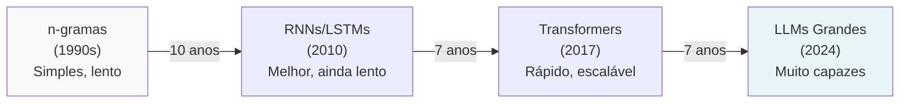
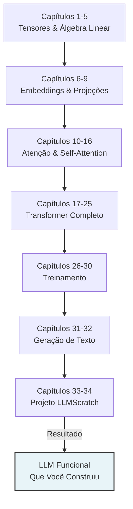

# Capítulo 01: Introdução e Motivação

## Objetivos

Ao final deste capítulo, você será capaz de:

1. Entender o que é uma Language Model e como funciona na prática
2. Saber por que estudar LLMs do zero é importante (não apenas usar)
3. Conhecer o caminho histórico que levou aos Transformers
4. Ver o mapa completo do que vamos construir juntos

---

## O que É Uma Language Model (Realmente)

Imagine que você está escrevendo uma mensagem e a gente pausa no meio:

```
Entrada: "Olá, tudo bem? Estou aprendendo sobre..."
Saída esperada: distribuição de probabilidades
```

Uma Language Model vai dizer: "A próxima palavra é provavelmente 'machine learning' (45% chance), ou 'IA' (30%), ou 'redes neurais' (15%)".

Ela não "sabe" a resposta certa. Ela aprendeu padrões em bilhões de textos: quando vê "aprendendo sobre", as próximas palavras mais comuns em seus dados foram essas.

```
"Olá, tudo bem? Estou aprendendo sobre..."
                                        ↓
                    [LANGUAGE MODEL]
                                        ↓
        [machine learning: 45%, IA: 30%, redes: 15%, ...]
```

Por que isso é útil? Porque essa habilidade aparentemente simples — prever o próximo token — quando aplicada repetidamente, gera textos coerentes. E quando o modelo é grande (treinado em bilhões de palavras), emergem capacidades surpreendentes: raciocínio, conhecimento de fatos, até código.

---

## Histórico: Como Chegamos Aqui

Vou ser honesto: a história das Language Models é uma jornada de "caramba, isso não vai funcionar" → "espera, está funcionando".

### Fase 1: Abordagens Simples (1990s-2000s)

**n-gramas** era o jeito mais antigo. Você contava: quantas vezes "o gato" aparecia seguido de "subiu"? Quantas vezes de "dormiu"? E aí você estimava probabilidades.

O problema: se a sequência nunca apareceu, você não sabia. E contexto distante era impossível. "Estou viajando para..." — a palavra "viagem" está longe demais, o n-grama (tipicamente n=3 ou n=5) não vê.

```
"Estou viajando para..." (100 palavras depois) "...foi incrível"
                    ↑
                n-grama não vê isso
```

### Fase 2: Redes Recorrentes (2000s-2015)

Aí chegaram as **RNNs** (Recurrent Neural Networks). A ideia era: ao invés de contar frequências, use uma rede neural que processa token por token, mantendo uma "memória" (um vetor oculto) que passa de um token para o próximo.

```
"Estou" → [rede neural] → estado oculto v1
   ↓
   v1 + "viajando" → [rede neural] → estado oculto v2
   ↓
   v2 + "para" → [rede neural] → estado oculto v3
   ...
   (100 passos depois)
   v100 → prediz "foi"
```

Problema: aquele estado oculto precisa "lembrar" de informação de 100 passos atrás. Na prática, a informação se dilui. É como passar um recado de boca em boca em uma fila de 100 pessoas — no final, ninguém lembra o original.

**LSTMs** (2015) tentaram consertar isso com "portas" que controlam o quê memorizar. Melhorou, mas ainda era lento (precisava processar sequencialmente).

### Fase 3: O Transformer (2017)

Aí em 2017 saiu um paper chamado "Attention is All You Need".

**A ideia**: esqueça processar sequencialmente. Processe tudo em paralelo. Use um mecanismo chamado **Atenção** que deixa cada token "olhar para" todos os outros tokens na sequência de uma vez.

```
"Estou viajando para ... foi incrível"
  ↑
  Este token pode olhar DIRETO para "viajando", "incrível", 
  qualquer um, sem passar por 100 intermediários
```

Por que isso importa? Porque GPUs são muito boas em computação paralela. Todas as palavras podem ser processadas ao mesmo tempo. Treinar 100x mais rápido.

Resultado: escalaram para modelos gigantes, bilhões de parâmetros.

### Fase 4: A Explosão (2018-2024)

```
2018: BERT, GPT (150M parâmetros) → "isso é legal"
2019: GPT-2 (1.5B) → "caramba, gera texto coerente"
2020: GPT-3 (175B) → "espera, faz coisas não treinadas?"
2023: GPT-4, Claude, Llama → "isso pensa?"
2024: Modelos ainda maiores e mais especializados
```

A observação empírica: quanto maior o modelo, quanto mais dados, melhor. Simples assim. Não é mágica — é escala.



---

## O Plano: Do Zero até Gerar Texto

Vou ser direto: este livro segue uma progressão que vai de "PyTorch básico" até "você treina um modelo de verdade e gera texto".



Cada fase constrói sobre a anterior. Não tem atalho: você precisa entender tensores antes de embeddings, embeddings antes de atenção, etc.

Por que essa ordem? Porque é a ordem em que os dados fluem através de uma Language Model real.

---

## Por Que Construir do Zero?

Aqui está a questão que você pode estar fazendo: "Não posso só usar HuggingFace Transformers e fazer fine-tuning?"

Tecnicamente, sim. Mas está perdendo a oportunidade de realmente entender o que está acontecendo.

Vou dar um exemplo real: você está treinando um modelo e de repente pega NaN (Not a Number) na loss. Isso acontece toda hora em deep learning.

Se você usar uma biblioteca pré-pronta como caixa preta, você vai clicar aleatoriamente em hiperparâmetros até funcionar. "Vou tentar learning rate menor... não, maior... talvez mudar batch size..."

Mas se você implementou o modelo manualmente, você sabe: "Espera, NaN geralmente significa exploding gradients. Deixa eu verificar os pesos iniciais... ah, estão com desvio padrão muito grande. Vou usar Xavier initialization."

**Entendimento permite debug.**

```
Usar caixa preta sem entender:
  Erro → Clicar aleatório → Erro diferente → Clicar mais → 😤

Entender o mecanismo:
  Erro → Hipótese sobre causa → Teste → Aprendizado → ✓
```

Então aqui está a filosofia deste livro:

1. Implementar com operações explícitas (`.matmul()`, não `nn.Linear`)
2. Entender o que está acontecendo nos números
3. Depois usar abstrações (nn.Module) confiadamente
4. E quando der problema, você sabe debugar

Isso leva mais tempo inicialmente. Vale a pena.

---

## Os Exemplos que Vamos Usar

Para manter tudo concreto e legível, vamos repetir os mesmos exemplos pequenos durante todo o livro.

**Exemplo Padrão de Entrada**:

```
Frase: "O gato dormia"
Vocabulário: 1000 palavras diferentes
Embedding dimension: 4 (espaço bem pequeno para ver os números)

Tokenizado: [token_id=1, token_id=2, token_id=3]
Shape: [3] (3 tokens)

Com batch: [batch_size=2, seq_len=3]
Shape real: [2, 3]

Com embeddings: [batch_size=2, seq_len=3, d_model=4]
Shape: [2, 3, 4] ← verá cada número em uma tabela
```

Por que esses números pequenos?

```
Embedding dimension = 4 significa você verá 16 números por token
Se usasse d_model=768 (real), veria 2304 números
Impossível fazer sentido visualmente

Com 4, você entende. Depois escala para 768
```

**Pesos (Matrizes de Transformação)**:

Quando projetarmos embeddings (transformar de uma dimensão para outra), usaremos matrizes da forma [4, 4], [4, 2], etc. Sempre números pequenos que você consegue ver.

---

## O Código que Você Vai Escrever

Quero ser claro: o "toy model" abaixo é tudo o que você vai construir e entender no final. Mas aqui está o ponto:

```python
class LLMPequena(nn.Module):
    def __init__(self, vocab_size, d_model):
        super().__init__()
        
        # Entender embedding
        self.embed = nn.Embedding(vocab_size, d_model)
        
        # Entender self-attention
        self.attention = SelfAttention(d_model)
        
        # Entender feedforward
        self.mlp = FeedForward(d_model)
        
        # Saída
        self.head = nn.Linear(d_model, vocab_size)
    
    def forward(self, input_ids):
        x = self.embed(input_ids)           # Capítulo 6-7
        x = self.attention(x)               # Capítulo 10-16
        x = self.mlp(x)                     # Capítulo 20
        logits = self.head(x)               # Capítulo 26
        return logits
```

Você não vai copiar isso. Você vai *construir* cada linha entendendo o quê está fazendo e por quê.

---

## Erros Comuns que as Pessoas Fazem

Vou ser honesto sobre as armadilhas que vejo o tempo todo:

### "Vou pular álgebra linear"

Você pensa: "Eu só quero usar PyTorch, não preciso de matemática."

Realidade: 80% dos problemas que você vai ter (exploding gradients, NaN, modelo não converge) são problemas de álgebra linear que você não consegue debugar sem entender a matemática.

Exemplo real: Um dia você vê seu modelo retornando NaN. Sem álgebra linear, você pensa "deixa eu tentar outro learning rate". Com álgebra linear, você pensa "matriz mal condicionada" → reduz escala → pronto.

Tempo para aprender: 2-3 horas. Economia posterior: semanas de debugging.

### "Vou direto usar HuggingFace Transformers"

Claro, você consegue. Mas aí é como dirigir um carro sem saber como funciona o motor. Funciona até quebrar.

O objetivo aqui é você saber o que está acontecendo dentro. Depois, quando usar Transformers, você vai debugar melhor e fazer ajustes mais inteligentes.

### "Shapes são detalhe, não precisam ler e debugá los"

Isto é errado. Literalmente 80% dos bugs em deep learning são "shape mismatch" — você tenta multiplicar [32, 10] por [64, 5] e a dimensão não bate.

Neste livro vamos ficar muito focado em shapes. Por quê? Porque uma vez que você domina, o resto é fácil.

### "LLMs são mágica, não vou entender"

Aqui está a verdade: Transformers são 90% matemática e 10% "trick" de engenharia. A matemática é entendível. Não há mágica real.

Se você consegue somar números, você consegue entender transformers.

---

## Para Você Praticar (Não é Teste)

Esses exercícios não têm "resposta certa". São para você pensar.

### Exercício 1: O que Você Já Sabe

Você já usou ChatGPT, Claude, ou outro LLM? Escreva em 3-4 frases:

1. Qual foi a resposta mais útil que você recebeu?
2. O que você acha que estava acontecendo "por trás" para gerar essa resposta?

Não precisa estar tecnicamente certo. Estamos apenas ancorar o que você já observou.

### Exercício 2: Predição de Próxima Palavra

Complete a frase. Você pode falar 5 palavras que faria sentido:

```
"Estou aprendendo sobre inteligência artificial porque..."
```

Agora, qual você acha que um modelo grande colocaria como **mais provável (TOP-1)**?

Exemplo de resposta: 
- Palavras possíveis: é importante, quero trabalhar, é fascinante, preciso, gosto
- TOP-1 provável: "quero trabalhar" (muito comum em contexto educacional)

### Exercício 3: Escala

Procure online (ou deixa que te digo):
- Quantos parâmetros tem GPT-4?
- Quantos tem Llama 2 70B?
- Quantos bilhões é isso comparado ao número de neurônios do seu cérebro (~86B)?

Escreva os números. Depois pense: quanto maior o modelo, provavelmente melhor. Você concorda?

---

## Respostas Esperadas (Para Você Comparar)

### Exercício 1: O que Você Já Sabe

Não há resposta única. Mas você deve ter alguma observação. A gente tira daí.

### Exercício 2: Predição

Palavras que fazem sentido:
- "quero trabalhar", "é importante", "é fascinante", "preciso saber", "gosto"

Modelos grandes tipicamente colocam "quero trabalhar" ou "é importante" como TOP-1, porque são muito frequentes em textos educacionais.

### Exercício 3: Escala

Números reais (aproximados):
- GPT-4: não é público, estimativas 170B-1T (varia muito)
- Llama 2 70B: 70 bilhões de parâmetros
- Cérebro humano: 86 bilhões de neurônios (mas é diferente de parâmetros)

A tendência histórica: modelos maiores são sempre melhores. Isso é chamado "scaling laws" — quanto mais parâmetros e dados, melhor a performance.

---

## Resumo: Por Que Este Livro Existe

Você pode aprender LLMs de duas formas:

1. Usar bibliotecas prontas → rápido, mas é mágica
2. Construir do zero → demorado, mas entende tudo

Este livro escolhe a rota 2. Por quê?

Porque quando você entender cada operação (embedding, atenção, treinamento), você consegue:
- Debugar quando algo quebra
- Fazer alterações inteligentes
- Ler papers de pesquisa e entender
- Contribuir com ideias novas

Alguns números para te motivar:
- 13 capítulos de fundamentos
- 15+ experimentos que você roda com seus próprios olhos
- 50+ exercícios
- 1 projeto final: um LLM que VOCÊ construiu

Tempo investido: 50-60 horas de leitura + implementação

Valor? Você não apenas usa LLMs. Você os constrói.

Próximo passo: [Capítulo 02: Setup do Ambiente](02_setup_ambiente.md)
