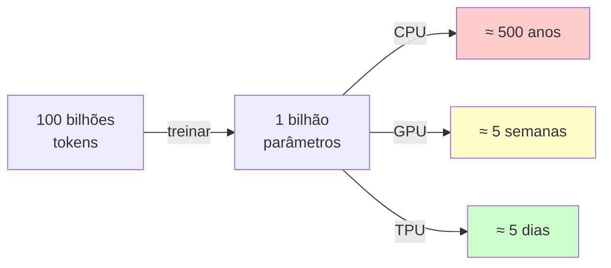

# Capítulo 02: Setup do Ambiente

## Objetivos

Ao final deste capítulo, você será capaz de:

1. Instalar PyTorch corretamente (e escolher versão para seu hardware)
2. Criar um ambiente Python isolado para não quebrar nada
3. Verificar que tudo funciona (especialmente aceleração GPU/MPS)
4. Entender por quê cada passo é necessário
5. Rodar seu primeiro tensor com sucesso

---

## Por Que Isso Importa: O Custo Computacional Real

Imagine que você vai treinar um modelo com 1 bilhão de parâmetros em 100 bilhões de palavras.

Sem GPU:
- CPU moderna faz ~10 bilhões de operações por segundo
- Total: 100 bilhões textos × 1 bilhão parâmetros × múltiplas passadas
- Tempo estimado: séculos

Com GPU (NVIDIA/Apple Silicon):
- 100 vezes mais rápido (~1 trilhão ops/sec)
- Tempo: dias/semanas

Com TPU (Google):
- 1000 vezes mais rápido
- Tempo: horas/dias



Por isso PyTorch é essencial. Sem ela (ou TensorFlow), você está fazendo cálculos longos à mão.

**PyTorch = calculadora que sabe usar sua GPU.**

---

## Passo a Passo de Instalação

### Prerequisito: Verificar Python

```bash
python3 --version
```

Você precisa de Python 3.10 ou maior. Se não tiver:

```bash
# macOS (via Homebrew)
brew install python@3.11

# Ubuntu/Debian
sudo apt install python3.11

# Windows (via Python.org ou chocolatey)
choco install python
```

### Passo 1: Virtual Environment (Isolamento)

**Por quê?** Cada projeto Python tem versões diferentes de bibliotecas. Sem venv, você instala uma versão que quebra outro projeto.

```bash
cd /Users/mrlopito/Documents/desenv/llm-book

python3 -m venv venv
source venv/bin/activate

# Se está ativado, você verá "(venv)" no prompt
```

Isso cria uma pasta `venv/` com Python isolado. Depois, sempre que quiser trabalhar:

```bash
source venv/bin/activate
```

### Passo 2: Upgrade pip (Gerenciador de Pacotes)

```bash
pip install --upgrade pip setuptools wheel
```

Pip é o programa que baixa e instala bibliotecas Python.

### Passo 3: Instalar PyTorch (Escolha Seu Sistema)**

Escolha conforme seu sistema:

#### macOS Apple Silicon (M1/M2/M3)

Você tem o melhor hardware para começar:

```bash
pip install torch torchvision torchaudio
```

PyTorch automaticamente usa Metal Performance Shaders (MPS), que acelera em ~5-10x comparado a CPU puro. Depois você pode verificar se está funcionando (próxima seção).

#### macOS Intel

```bash
pip install torch torchvision torchaudio
```

Funcionará em CPU (mais lentidão). Se quiser GPU, precisa de eGPU NVIDIA (raro em Mac).

#### Windows com NVIDIA GPU

Você precisa conhecer qual versão do CUDA está instalada:

```cmd
nvidia-smi
```

Procure "CUDA Version: X.X" no output. Depois:

```bash
# Para CUDA 11.8 (mais comum)
pip install torch torchvision torchaudio --index-url https://download.pytorch.org/whl/cu118

# Para CUDA 12.1 (mais novo)
pip install torch torchvision torchaudio --index-url https://download.pytorch.org/whl/cu121
```

Sem GPU NVIDIA, use CPU:

```bash
pip install torch torchvision torchaudio
```

#### Linux com NVIDIA GPU

```bash
# Para CUDA 11.8
pip install torch torchvision torchaudio --index-url https://download.pytorch.org/whl/cu118
```

Verifique CUDA com `nvidia-smi`.

#### Linux com AMD GPU (ROCm)

```bash
pip install torch torchvision torchaudio --index-url https://download.pytorch.org/whl/rocm5.7
```

#### Todos os Sistemas (CPU-only)

Se nenhum dos acima aplica, use:

```bash
pip install torch torchvision torchaudio
```

Funcionará, mas será mais lento. OK para aprender.

### Passo 4: Extras (Opcionais Mas Recomendados)

```bash
pip install numpy matplotlib jupyter
```

Explicação:
- **NumPy**: Biblioteca de matrizes, usamos para comparar com PyTorch
- **Matplotlib**: Desenhar gráficos (veremos loss durante treinamento)
- **Jupyter**: Cadernos interativos (não obrigatório, mas útil)

### Passo 5: Verificar Que Tudo Funciona**

Crie um arquivo `test_setup.py` para verificar:

```python
import torch
import numpy as np

print("\n" + "="*60)
print("TEST: James Jr. Environment Setup")
print("="*60 + "\n")

# Versions
print("Versions:")
print(f"  PyTorch: {torch.__version__}")
print(f"  NumPy: {np.__version__}")

# Check GPU/MPS availability
print("\nAccelerators:")
print(f"  MPS (Apple Silicon): {torch.backends.mps.is_available()}")
print(f"  CUDA (NVIDIA): {torch.cuda.is_available()}")

# Choose device
if torch.backends.mps.is_available():
    device = torch.device("mps")
    print(f"\nUsing: Metal Performance Shaders (MPS) - Fast!")
elif torch.cuda.is_available():
    device = torch.device("cuda")
    print(f"\nUsing: CUDA (NVIDIA) - Fast!")
else:
    device = torch.device("cpu")
    print(f"\nUsing: CPU - Slower, but works")

# Test: Tensor computation
print(f"\nTest 1: Matrix Multiplication on {device}")
x = torch.randn(100, 100, device=device)
y = torch.randn(100, 100, device=device)
z = torch.matmul(x, y)
print(f"  [100, 100] @ [100, 100] = {z.shape} ✓")

# Test: Gradients
print(f"\nTest 2: Gradients (Backprop)")
w = torch.tensor([1.0, 2.0, 3.0], requires_grad=True, device=device)
loss = (w ** 2).sum()
loss.backward()
print(f"  w = {w.data}")
print(f"  loss = sum(w^2) = {loss.item():.1f}")
print(f"  dL/dw = {w.grad} ✓")

print("\n" + "="*60)
print("SUCCESS: Setup is working!")
print("="*60 + "\n")
```

Rode:

```bash
python test_setup.py
```

Esperado (Apple Silicon):

```
TEST: James Jr. Environment Setup

Versions:
  PyTorch: 2.0.1
  NumPy: 1.24.3

Accelerators:
  MPS (Apple Silicon): True
  CUDA (NVIDIA): False

Using: Metal Performance Shaders (MPS) - Fast!

Test 1: Matrix Multiplication on mps
  [100, 100] @ [100, 100] = torch.Size([100, 100]) ✓

Test 2: Gradients (Backprop)
  w = tensor([1., 2., 3.])
  loss = sum(w^2) = 14.0
  dL/dw = tensor([2., 4., 6.]) ✓

SUCCESS: Setup is working!
```

Se vir `MPS: True`, perfeito — GPU funcionando.  
Se vir `MPS: False`, sem problemas — CPU funciona, apenas mais lento.

---

## Computar Onde? (CPU vs GPU)

Depois de instalar, PyTorch precisa saber: "Onde você quer que eu compute isso?"

**Opções:**

| Dispositivo | Velocidade | Disponível |
|-------------|-----------|-----------|
| CPU | 1x (baseline) | Todos |
| MPS (Apple Silicon) | 5-10x | M1/M2/M3+ |
| CUDA (NVIDIA) | 10-100x | Com GPU NVIDIA |

**Padrão que vamos usar:**

```python
# Detectar automaticamente
if torch.backends.mps.is_available():
    device = "mps"
elif torch.cuda.is_available():
    device = "cuda"
else:
    device = "cpu"

# Agora: criar tensor nesse dispositivo
x = torch.randn(3, 4, device=device)

# Ou mover tensor depois
x = torch.randn(3, 4)
x = x.to(device)  # Move para device
```

**Importante:** Todos os tensores em uma operação devem estar no **mesmo dispositivo**. Se tentar `x (no MPS) + y (no CPU)`, terá erro.

Solução: Sempre criar tensores já no device correto:

```python
x = torch.randn(3, 4, device=device)  # Certo
y = torch.randn(3, 4, device=device)  # Certo
z = x + y  # Funciona

# Errado:
x = torch.randn(3, 4, device="mps")
y = torch.randn(3, 4, device="cpu")
z = x + y  # RuntimeError!
```

---

## 📦 Requisitos (sem criar arquivo extra)

Se preferir, aqui está o equivalente de um `requirements.txt` em formato Markdown, para colar no console se necessário:

```bash
# Versão minimal (recomendada)
pip install torch>=2.0 numpy matplotlib

# Versão com extras opcionais
pip install torch>=2.0 numpy matplotlib jupyter ipython
```

---

## 🧪 Experimento: Primeira Operação

Crie `primeiro_tensor.py`:

```python
import torch

# Criar dois vetores
a = torch.tensor([1.0, 2.0, 3.0])
b = torch.tensor([4.0, 5.0, 6.0])

# Operações
soma = a + b
produto_escalar = torch.dot(a, b)
elemento_wise = a * b

print("Vetor a:", a)
print("Vetor b:", b)
print("\na + b:", soma)
print("a · b (dot product):", produto_escalar)
print("a ⊙ b (elemento-wise):", elemento_wise)

# Operação com matriz
M = torch.tensor([
    [1.0, 2.0],
    [3.0, 4.0],
    [5.0, 6.0]
])

v = torch.tensor([1.0, 2.0])

resultado = torch.matmul(M, v)

print("\nMatriz M:")
print(M)
print("\nVetor v:", v)
print("\nM @ v (matrix-vector product):")
print(resultado)
```

Rode:

```bash
python primeiro_tensor.py
```

Output esperado:

```
Vetor a: tensor([1., 2., 3.])
Vetor b: tensor([4., 5., 6.])

a + b: tensor([5., 7., 9.])
a · b (dot product): tensor(32.)
a ⊙ b (elemento-wise): tensor([ 4., 10., 18.])

Matriz M:
tensor([[1., 2.],
        [3., 4.],
        [5., 6.]])

Vetor v: tensor([1., 2.])

M @ v (matrix-vector product):
tensor([ 5., 11., 17.])
```

---

## Quando Algo Quebra

### "ModuleNotFoundError: No module named 'torch'"

Você rodou `python test_setup.py` mas viu esse erro?

**Diagnóstico:**

```bash
# Verifique se venv está ativado
echo $VIRTUAL_ENV  # Deve mostrar caminho, não vazio

# Se vazio:
source venv/bin/activate
```

Ou você pode estar em Python do sistema, não do venv. Rode:

```bash
which python  # Deve mostrar algo com "venv"
```

Se não mostrar, ative venv de novo.

### "RuntimeError: Expected all tensors to be on the same device"

Você tem:

```python
x = torch.randn(3, 4, device="mps")
y = torch.randn(3, 4, device="cpu")
z = x + y  # Erro!
```

**Solução:** Use a mesma variável de device:

```python
device = torch.device("mps")  # Escolha UMA vez

x = torch.randn(3, 4, device=device)
y = torch.randn(3, 4, device=device)
z = x + y  # Funciona
```

### "MPS is not available" / Usando CPU

Seu Mac não tem Apple Silicon (é Intel), ou seu Python não suporta ainda.

**Solução:** CPU é OK para este livro:

```python
device = "cpu"  # Use CPU, sem problema
```

Será mais lentidão (talvez 5-10x), mas tudo funciona igual. Você aprende.

---

## Para Você Praticar

Depois de rodar `test_setup.py` com sucesso, experimente:

### Exercício 1: Verificar Seu Device

```bash
python3 << 'EOF'
import torch

device = torch.device(
    "mps" if torch.backends.mps.is_available() else
    "cuda" if torch.cuda.is_available() else
    "cpu"
)

print(f"Your device: {device}")

# Crie um tensor grande e compute algo
x = torch.randn(10000, 10000, device=device)
y = torch.randn(10000, 10000, device=device)

import time
start = time.time()
z = torch.matmul(x, y)
elapsed = time.time() - start

print(f"Matrix mult [10k, 10k]: {elapsed:.3f}s on {device}")
EOF
```

A velocidade depende do seu device:
- MPS: ~0.5s
- CUDA: ~0.1s
- CPU: ~5-10s

Se seu device é lento, não se preocupe. Os modelos do livro são pequenos.

### Exercício 2: Tensor e Gradientes

```python
import torch

# Crie tensor que será treinado
w = torch.tensor([1.0, 2.0], requires_grad=True)

# Compute função
y = 3 * w**2 + 2

# Backward
loss = y.sum()
loss.backward()

print(f"Gradientes: {w.grad}")
# Esperado: tensor([6., 12.]) porque d(3w^2)/dw = 6w
```

Você consegue pensar por quê o gradiente é [6., 12.]?

Dica: para w=1, a derivada é 6*1=6. Para w=2, é 6*2=12.

### Exercício 3: Debugar Device Mismatch

Propositalmente, cometa um erro:

```python
import torch

x = torch.randn(3, 4, device="cpu")
y = torch.randn(3, 4, device="cpu")

try:
    # Faça y estar em device diferente
    y = y.to("mps") if torch.backends.mps.is_available() else y
    
    # Agora tente somar
    z = x + y
except RuntimeError as e:
    print(f"Erro esperado: {e}")
    
    # Solução
    device = "mps" if torch.backends.mps.is_available() else "cpu"
    x = x.to(device)
    y = y.to(device)
    z = x + y
    print(f"Funcionando agora!")
```

Aprender a ver esses erros é importante. Você vai ver muito.

---

## Resumo: Agora Você Tem Um Ambiente de Trabalho

Pronto. Você tem:

1. Python 3.10+ instalado
2. Virtual environment isolado
3. PyTorch funcionando (CPU, MPS, ou CUDA)
4. NumPy e matplotlib para cálculos e gráficos
5. Um script que testa tudo

Próximo capítulo vai ser prático: vamos criar tensores, fazer cálculos, ver gradientes. Tudo que você configurou agora vai ser usado.

**Antes de ir adiante**: Se `test_setup.py` não rodou sem erro, não avance. Volta e repara. O resto do livro depende disso funcionar.

Está pronto? Então vamos começar a computar.

Próximo: [Capítulo 03: Tensores e PyTorch](03_tensores_e_pytorch.md)
