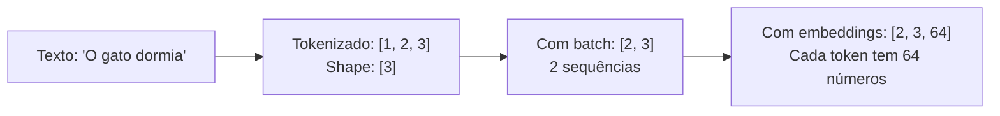

# Capítulo 03: Tensores e PyTorch

## Objetivos

Ao final deste capítulo, você será capaz de:

1. Criar tensores e entender o que são
2. Trabalhar com shapes (dimensões) — 80% dos bugs vêm daqui
3. Fazer operações básicas: soma, multiplicação, transposta
4. Usar broadcasting (a "mágica" do PyTorch)
5. Calcular e entender gradientes (como o modelo aprende)

---

## O que É Um Tensor, De Verdade

Um tensor é uma coleção de números organizados em dimensões. Generalização simples:

```
0D (Escalar):      5
                   Um número só

1D (Vetor):        [1, 2, 3, 4]
                   Uma sequência

2D (Matriz):       [[1, 2, 3],
                    [4, 5, 6]]
                   Uma grade

3D (Tensor):       [[[1, 2],
                     [3, 4]],
                    [[5, 6],
                     [7, 8]]]
                   Um cubo de números
```

**Em LLMs, você verá:**



Entender shapes é entender 80% do que vai dar problema em deep learning.

**PyTorch** é a ferramenta que permite você criar, manipular e otimizar esses tensores em GPU (muito rápido).

---

## Shape: O Conceito Que Vai Te Salvar

Todo erro que você vai ter relacionado a tensores é um erro de shape.

```
"RuntimeError: mat1 and mat2 shapes cannot be multiplied"
                    ↓
                Shape mismatch
```

### Nomenclatura

Usamos `[tamanho0, tamanho1, tamanho2]` para descrever shape:

```python
import torch

x = torch.randn(2, 3, 4)
# Shape [2, 3, 4]:
#   - Dimensão 0: tamanho 2
#   - Dimensão 1: tamanho 3  
#   - Dimensão 2: tamanho 4
# Total de números: 2 × 3 × 4 = 24

# Explorar o tensor
x.shape      # torch.Size([2, 3, 4])
x.ndim       # 3 (número de dimensões)
x.numel()    # 24 (número total de elementos)
x.dtype      # torch.float32 (tipo numérico)
x.device     # cpu, mps, cuda, etc
```

Na prática de LLMs:

```
[batch_size, seq_len, embedding_dim]
[32, 10, 64]  ← seu tensor típico durante treinamento
```

- 32 = você processa 32 exemplos de uma vez
- 10 = cada sequência tem 10 tokens (máximo)
- 64 = cada token é representado por 64 números (embedding)

---

## Criando Tensores (Todos os Jeitos)

Na prática, você cria tensores de poucas formas:

```python
import torch

# 1. Do zero (valores específicos que você define)
x = torch.tensor([1.0, 2.0, 3.0])        # [3]
X = torch.tensor([[1.0, 2.0], [3.0, 4.0]])  # [2, 2]

# 2. Aleatório (usado pra inicializar pesos)
x = torch.randn(3, 4)   # Números aleatórios, distribuição normal [3, 4]
x = torch.rand(3, 4)    # Aleatório entre 0 e 1 [3, 4]

# 3. Especiais (zeros, uns, identidade)
zeros = torch.zeros(2, 3)  # Matriz de zeros [2, 3]
ones = torch.ones(2, 3)    # Matriz de uns [2, 3]
identity = torch.eye(3)    # Identidade [3, 3]

# 4. Sequências
seq1 = torch.arange(0, 10)          # [0, 1, 2, ..., 9]
seq2 = torch.linspace(0, 1, 5)      # [0, 0.25, 0.5, 0.75, 1]
```

**Que você usará mais?**

- `torch.randn()` — inicializar pesos aleatoriamente
- `torch.tensor()` — dados que você já tem
- `torch.zeros()` / `torch.ones()` — raramente, mas às vezes

Quando criar tensores para treinamento, sempre especifique `device`:

```python
device = "mps"  # ou "cuda" ou "cpu"

x = torch.randn(2, 3, 4, device=device)
# Já começa no device certo, não precisa mover depois
```

---

## Operações de Shape (Reorganizar Dados)

### Transposta

```python
x = torch.randn(2, 3)  # [2, 3]
xT = x.T  # [3, 2]
# ou
xT = x.transpose(0, 1)  # swap dimensões 0 e 1
```

### Reshape (Muda shape, mesmos elementos)

```python
x = torch.randn(6)  # [6]
x_reshaped = x.reshape(2, 3)  # [2, 3]
x_reshaped = x.view(2, 3)  # Alternativa (mais rápida em alguns casos)

# -1 significa "deduz este tamanho"
x = torch.randn(2, 3, 4)  # [2, 3, 4] = 24 elementos
x_flat = x.reshape(-1)  # [24]
x_back = x_flat.reshape(2, 3, 4)  # De volta a [2, 3, 4]
```

### Squeeze e Unsqueeze (Remove/Adiciona dimensões de tamanho 1)

```python
x = torch.randn(2, 1, 3)  # [2, 1, 3]
x_squeezed = x.squeeze()  # [2, 3] - remove dimensões tamanho 1

y = torch.randn(2, 3)  # [2, 3]
y_unsqueezed = y.unsqueeze(0)  # [1, 2, 3] - adiciona dim no índice 0
y_unsqueezed = y.unsqueeze(1)  # [2, 1, 3] - adiciona dim no índice 1
```

### Concatenação e Stacking

```python
a = torch.randn(2, 3)
b = torch.randn(2, 3)

# Concatenar ao longo de dimensão existente
concat = torch.cat([a, b], dim=0)  # [4, 3] - 2 + 2 nas linhas
concat = torch.cat([a, b], dim=1)  # [2, 6] - 3 + 3 nas colunas

# Stack (cria nova dimensão)
stacked = torch.stack([a, b], dim=0)  # [2, 2, 3]
stacked = torch.stack([a, b], dim=1)  # [2, 2, 3] - outra ordem
```

---

## Operações Básicas

### Elemento-wise

```python
a = torch.tensor([1.0, 2.0, 3.0])
b = torch.tensor([4.0, 5.0, 6.0])

soma = a + b  # [5, 7, 9]
dif = a - b   # [-3, -3, -3]
prod = a * b  # [4, 10, 18] - elemento-wise, não matriz
div = a / b   # [0.25, 0.4, 0.5]
pot = a ** 2  # [1, 4, 9]
```

### Álgebra Linear

```python
a = torch.randn(3, 4)
b = torch.randn(4, 5)

# Multiplicação matricial
c = torch.matmul(a, b)  # [3, 5]
c = a @ b  # Sintaxe mais curta, idêntica

# Transposta
aT = a.T  # [4, 3]

# Produto escalar (dot product)
v1 = torch.tensor([1.0, 2.0, 3.0])
v2 = torch.tensor([4.0, 5.0, 6.0])
dot = torch.dot(v1, v2)  # 1*4 + 2*5 + 3*6 = 32

# Norma
norm = torch.norm(v1)  # sqrt(1^2 + 2^2 + 3^2) = sqrt(14) ≈ 3.74
```

### Reduções

```python
x = torch.tensor([[1.0, 2.0, 3.0],
                  [4.0, 5.0, 6.0]])  # [2, 3]

# Soma
total = x.sum()  # 21.0 (todos elementos)
por_coluna = x.sum(dim=0)  # [5, 7, 9] - soma ao longo das linhas (dim 0)
por_linha = x.sum(dim=1)  # [6, 15] - soma ao longo das colunas (dim 1)

# Média
media_total = x.mean()  # 3.5
media_coluna = x.mean(dim=0)  # [2.5, 3.5, 4.5]

# Max/Min
maximo = x.max()  # 6.0
idx_maximo = x.argmax()  # índice do maior elemento

# Keepdim (mantém dimensão)
soma_keepdim = x.sum(dim=1, keepdim=True)  # [[6], [15]] em vez de [6, 15]
```

---

## Broadcasting

Broadcasting é a "mágica" do PyTorch que permite operações entre tensores de shapes diferentes.

### Regra Simples

Quando você opera dois tensores de shapes diferentes, PyTorch tenta **expandir** o menor:

```python
# Exemplo 1: Vetor + Escalar
v = torch.tensor([1.0, 2.0, 3.0])  # [3]
escalar = torch.tensor(10.0)  # []

resultado = v + escalar  # [11, 12, 13]
# O escalar é "broadcasted" (expandido) para [10, 10, 10]
```

```python
# Exemplo 2: Matriz + Vetor
matriz = torch.randn(3, 4)  # [3, 4]
vetor = torch.randn(4)      # [4]

resultado = matriz + vetor  # [3, 4]
# vetor é expandido: broadcasting ao longo da primeira dimensão
```

### Regras Formais

1. Se tensores têm diferentes número de dimensões, adicione 1s na esquerda do menor até que tenham o mesmo `ndim`.
2. Para cada dimensão, elas são compatíveis se:
   - São iguais, OU
   - Uma delas é 1 (e será expandida)

```python
# Exemplo: [3, 4, 1] e [1, 1, 5]
# Resultado: [3, 4, 5]
```

### Broadcasting em LLMs

Na prática:

```python
# Batch de embeddings
embeddings = torch.randn(32, 10, 64)  # [batch_size, seq_len, embedding_dim]

# Bias que queremos subtrair de TODOS
bias = torch.randn(64)  # [64]

# Broadcasting automático
resultado = embeddings - bias  # [32, 10, 64]
# bias é expandido de [64] para [1, 1, 64] e depois [32, 10, 64]
```

---

## Gradientes e Autograd (Como o Modelo Aprende)

PyTorch computa gradientes **automaticamente**. Aqui está como:

### Habilitando Gradientes

```python
# Criar tensor que quer gradientes
x = torch.tensor([1.0, 2.0, 3.0], requires_grad=True)

# Computar operações
y = x ** 2
z = y.sum()  # Escalar

# Pedir gradiente
z.backward()  # Computa ∇z em relação a todos requires_grad=True

print(x.grad)  # tensor([2., 4., 6.])
# Porque dz/dx = d(x^2)/dx = 2*x = [2, 4, 6]
```

### Entendendo Gradientes

Gradiente (`grad`) nos diz a **direção e intensidade da mudança**.

Se você incrementar `x[0]` por um pouco, `z` aumentará ~2 vezes.
Se você decrementar `x[1]`, `z` diminuirá ~4 vezes.

Isso é essencial para **otimização**: para diminuir `z`, você se move na **direção oposta ao gradiente**.

### Limpando Gradientes

Gradientes se **acumulam**:

```python
x = torch.tensor([1.0], requires_grad=True)

# Primeira passagem
y = x ** 2
y.backward()
print(x.grad)  # tensor([2.]) - dy/dx quando x=1

# Segunda passagem
y = x ** 3
y.backward()
print(x.grad)  # tensor([5.]) - ACUMULOU! 2 + 3
```

Para resetar:

```python
x.grad.zero_()  # ou x.grad = None
```

### Graph de Computação

PyTorch constrói um "grafo" das operações:

```python
x = torch.tensor(2.0, requires_grad=True)
y = x ** 2
z = y * 3

# Grafo:
# x --[y = x^2]--> y --[z = y*3]--> z
#
# Backward (chain rule):
# dz/dx = dz/dy * dy/dx = 3 * 2x = 6 * 2 = 12

z.backward()
print(x.grad)  # tensor(12.)
```

---

## Experimento: Shapes e Broadcasting

Crie `experimento_shapes.py`:

```python
import torch

print("=" * 60)
print("EXPERIMENTO: Shapes e Broadcasting")
print("=" * 60)

# Parte 1: Shapes Básicos
print("\n1. SHAPES BÁSICOS")
print("-" * 60)

x = torch.randn(2, 3, 4)
print(f"x.shape: {x.shape}")
print(f"x.numel(): {x.numel()}")  # Total de elementos
print(f"x.ndim: {x.ndim}")  # Número de dimensões

# Parte 2: Operações de Shape
print("\n2. OPERAÇÕES DE SHAPE")
print("-" * 60)

print(f"Original: {x.shape}")
print(f"Transposta (dim 0,1): {x.transpose(0, 1).shape}")
print(f"Reshape [-1]: {x.reshape(-1).shape}")
print(f"Squeeze: {x.squeeze().shape}")
print(f"Unsqueeze(0): {x.unsqueeze(0).shape}")

# Parte 3: Broadcasting
print("\n3. BROADCASTING")
print("-" * 60)

a = torch.randn(3, 1, 4)  # [3, 1, 4]
b = torch.randn(1, 5, 4)  # [1, 5, 4]

print(f"a.shape: {a.shape}")
print(f"b.shape: {b.shape}")

c = a + b  # Broadcasting para [3, 5, 4]
print(f"(a + b).shape: {c.shape}")

# Parte 4: Gradientes
print("\n4. GRADIENTES")
print("-" * 60)

x = torch.tensor([1.0, 2.0, 3.0], requires_grad=True)
y = 2 * x + 3  # y = 2x + 3
z = y.sum()    # z = sum(y) = sum(2x + 3)

print(f"x: {x.data}")
print(f"y = 2*x + 3: {y.data}")
print(f"z = sum(y): {z.data}")

z.backward()  # Computa gradientes

print(f"∂z/∂x: {x.grad}")
# Esperado: [2, 2, 2] porque d(2x+3)/dx = 2

# Parte 5: Exemplo Prático - Rede Neural Simples
print("\n5. EXEMPLO PRÁTICO: Rede Neural Simples")
print("-" * 60)

# Dados: batch de 4 exemplos, cada um com 3 features
X = torch.randn(4, 3)  # [batch_size, features]

# Pesos: 3 inputs, 2 outputs
W = torch.randn(3, 2, requires_grad=True)  # [in, out]
b = torch.randn(2, requires_grad=True)     # [out]

# Forward pass
Z = X @ W + b  # [4, 3] @ [3, 2] = [4, 2], depois add [2]
                # broadcasting: [2] -> [1, 2] -> [4, 2]

print(f"X.shape: {X.shape}")
print(f"W.shape: {W.shape}")
print(f"b.shape: {b.shape}")
print(f"Z = X @ W + b, Z.shape: {Z.shape}")

# Loss (simplified)
loss = Z.sum()

# Backward
loss.backward()

print(f"∇loss/∇W.shape: {W.grad.shape}")
print(f"∇loss/∂b.shape: {b.grad.shape}")

print("\n" + "=" * 60)
print("✓ Experimento Completo!")
print("=" * 60)
```

Rode:

```bash
python experimento_shapes.py
```

Output esperado:

```
============================================================
EXPERIMENTO: Shapes e Broadcasting
============================================================

1. SHAPES BÁSICOS
------------------------------------------------------------
x.shape: torch.Size([2, 3, 4])
x.numel(): 24
x.ndim: 3

2. OPERAÇÕES DE SHAPE
------------------------------------------------------------
Original: torch.Size([2, 3, 4])
Transposta (dim 0,1): torch.Size([3, 2, 4])
Reshape [-1]: torch.Size([24])
Squeeze: torch.Size([2, 3, 4])
Unsqueeze(0): torch.Size([1, 2, 3, 4])

3. BROADCASTING
------------------------------------------------------------
a.shape: torch.Size([3, 1, 4])
b.shape: torch.Size([1, 5, 4])
(a + b).shape: torch.Size([3, 5, 4])

4. GRADIENTES
------------------------------------------------------------
x: tensor([1., 2., 3.])
y = 2*x + 3: tensor([ 5.,  7.,  9.])
z = sum(y): tensor(21.)
∂z/∂x: tensor([2., 2., 2.])

5. EXEMPLO PRÁTICO: Rede Neural Simples
------------------------------------------------------------
X.shape: torch.Size([4, 3])
W.shape: torch.Size([3, 2])
b.shape: torch.Size([2])
Z = X @ W + b, Z.shape: torch.Size([4, 2])
∇loss/∇W.shape: torch.Size([3, 2])
∇loss/∂b.shape: torch.Size([2])

============================================================
✓ Experimento Completo!
============================================================
```

---

## Erros Comuns que as Pessoas Fazem

### Erro 1: Shapes Incompatíveis em Matmul

```python
# ❌ Errado
a = torch.randn(3, 4)
b = torch.randn(5, 6)
c = a @ b  # ERRO: (3,4) @ (5,6) não funciona

# ✓ Certo
b = torch.randn(4, 6)
c = a @ b  # OK: (3,4) @ (4,6) = (3,6)
```

### Erro 2: Gradientes em Operações Em-Place

```python
# ❌ Errado
x = torch.tensor([1.0, 2.0, 3.0], requires_grad=True)
x += 1  # Em-place
y = x.sum()
y.backward()  # ERRO: RuntimeError

# ✓ Certo
x = torch.tensor([1.0, 2.0, 3.0], requires_grad=True)
x = x + 1  # Nova atribuição, não em-place
y = x.sum()
y.backward()  # OK
```

### Erro 3: Gradientes se Acumulam

```python
# ❌ Errado - Gradientes dobram
x = torch.tensor([1.0], requires_grad=True)
for i in range(3):
    y = x ** 2
    y.backward()
    print(x.grad)  # [2.] depois [4.] depois [6.] - ACUMULOU!

# ✓ Certo
x = torch.tensor([1.0], requires_grad=True)
for i in range(3):
    y = x ** 2
    y.backward()
    print(x.grad)  # [2.]
    x.grad.zero_()  # Reset antes de próxima iteração
```

---

## ✍️ Exercícios

### Exercício 3.1: Shapes
Crie um tensor de shape [2, 3, 4]. Qual é seu `numel()`? Qual é seu `ndim`?

### Exercício 3.2: Transposta
Crie uma matriz [3, 4]. Qual é o shape de sua transposta?

### Exercício 3.3: Broadcasting
a tem shape [2, 1, 5]. b tem shape [1, 3, 5]. Qual é o shape de `a + b`?

### Exercício 3.4: Gradientes
Seja `x = [1, 2]` com `requires_grad=True`. Se `y = x^2` e `z = y.sum()`, qual é `x.grad` após `z.backward()`?

### Exercício 3.5: Rede Neural Simples
Você tem X [10, 20], W [20, 5], b [5]. Compute Z = X @ W + b. Qual é o shape de Z?

---

## Respostas

### Exercício 3.1: Shapes
```python
x = torch.randn(2, 3, 4)
print(x.numel())  # 24
print(x.ndim)     # 3
```

### Exercício 3.2: Transposta
```python
X = torch.randn(3, 4)
print(X.T.shape)  # [4, 3]
```

### Exercício 3.3: Broadcasting
```python
a = torch.randn(2, 1, 5)
b = torch.randn(1, 3, 5)
resultado = a + b
print(resultado.shape)  # [2, 3, 5]
```

### Exercício 3.4: Gradientes
```python
x = torch.tensor([1.0, 2.0], requires_grad=True)
y = x ** 2
z = y.sum()
z.backward()
print(x.grad)  # [2., 4.]
# Porque d(sum(x^2))/dx = [2x, 2x] = [2*1, 2*2] = [2, 4]
```

### Exercício 3.5: Rede Neural
```python
X = torch.randn(10, 20)
W = torch.randn(20, 5)
b = torch.randn(5)
Z = X @ W + b
print(Z.shape)  # [10, 5]
```

---

## Resumo

- **Tensores**: Generalização de escalares, vetores, matrizes.
- **Shapes**: Descrevem dimensões. São cruciais para debug.
- **Broadcasting**: Expande tensores menores automaticamente.
- **Gradientes**: PyTorch os computa automaticamente via autograd.
- **Operações básicas**: Elemento-wise, álgebra linear, reduções.

No próximo capítulo: **Álgebra Linear Essencial**, formalizando operações que já começou a usar.

---

**Próximo**: [Capítulo 04: Álgebra Linear Essencial](04_algebra_linear_essencial.md)
